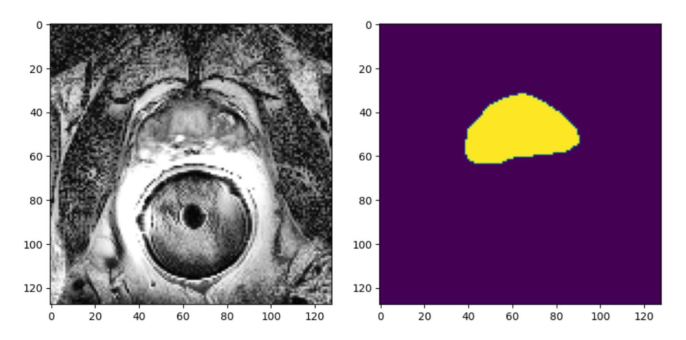
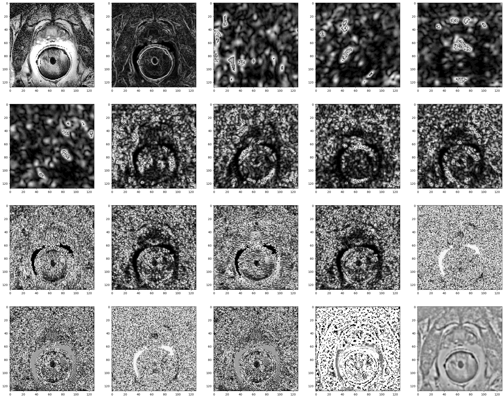

# Undergraduate / Postgraduate Assessed Coursework Tracking Sheet  

**Module Code**: MPHY0041  
**Module Title**: Machine Learning in Medical Imaging  
**Coursework Title**: Assessed Coursework  
**Lecturer**: Dr. Andre Altmann  
**Date Handed out**: Friday, October 25th 2024 

**Submission Instruction**:  
Before the submission deadline, you should digitally submit your source code and generated figures (a single Jupyter notebook file including your written answers). If you submit multiple files, all files need to be combined into one single zip file and submitted on the module page at UCL Moodle.  

**Coursework Deadline**: Friday, November 29th 2024 at 16:00 at UCL Moodle submission section

**Please note**: This is an AI Category 1 coursework (i.e., AI technologies cannot be used to solve the questions): [Link](https://www.ucl.ac.uk/teaching-learning/generative-ai-hub/using-ai-tools-assessment).  

Please submit a single Jupyter notebook file for Exercises 1, 2, and 3. The file should contain code, plots, and comments that help the understanding of your answers. You can give your written answers as a Markdown within the Jupyter notebook.  

The provided Jupyter notebook `Notebook_MPHY0041_2425_CW1.ipynb` contains the individual gap codes/functions for Exercise 2 and the functions provided for Exercise 3. Please use this notebook as the basis for your submission.  

---

## Exercise 1  
Load the dataset ‘Dementia_train.csv’ it contains diagnosis (DX), a cognitive score (ADAS13) and two cerebrospinal fluid (CSF) measurements for two proteins: amyloid and tau. There are three diagnostic labels: CN, MCI, and Dementia.  

### 1a)  
Remove MCI subjects from the dataset. Compute means for each of the three measurements (ADAS13, ABETA, TAU) for the ‘CN’ (𝜇ₙ) and the ‘Dementia’ (𝜇𝒅) groups. In addition, compute the standard deviation (𝜎) for these three measures across the diagnostic groups. Assume that the data follow a Gaussian distribution:  

$$f(x) = \frac{1}{\sqrt{2 \pi \sigma^2}} e^{ -\frac{(x - \mu)^2}{2 \sigma^2} }$$

with the means and standard deviation as computed above. Compute the decision boundary between the two disease groups for each of the three features (with the prior probabilities πₙ = πₒ = 0.5).  

Load the dataset ‘Dementia_test.csv’ that contains the same information for another 400 participants. After removing people with MCI, use the decision boundaries from above to compute accuracy, sensitivity, and specificity for separating CN from Dementia for each of the three features. [8]  

### 1b)  
Using sklearn functions, train a LinearRegression to separate CN from Dementia subjects using ABETA and TAU values as inputs. Generate a scatter plot for ABETA and TAU using different colours for the two diagnostic groups. Compute the decision boundary based on the linear regression and add it to the plot. What is the accuracy, sensitivity, and specificity of your model on the test data for separating CN from Dementia? [7]  

### 1c)  
The previous analyses ignored the subjects with MCI. Going back to the full dataset, compute means for all three groups for ABETA and TAU as well as the joint variance-covariance matrix Σ. Use these to compute linear decision boundaries between all pairs of classes (with the prior probabilities πₙ = πₘ = πₒ = 0.33) without using any models implemented in sklearn. Generate a new scatterplot and add the three decision boundaries. What is the accuracy, sensitivity, and specificity for separating CN from Dementia with this method? [10]  

---

## Exercise 2  
Here we complete implementations for different machine learning algorithms. The code with gaps can be found in the notebook `Notebook_MPHY0041_2425_CW1.ipynb`.  

### 2a)  
The function `fit_LogReg_IWLS` contains a few gaps that need to be filled for the function to work. This function implements Logistic Regression using iterative weighted least squares (IWLS) as introduced in the lectures. Use your function to train a model that separates Healthy controls from PD subjects in the `LogReg_data.csv` dataset (DX column indicates PD status, remaining columns are the features). Use the LogisticRegression implemented in sklearn to train a model on the same data. Make a scatter plot between the coefficients obtained from your implementation and the sklearn model. Comment on the result.  

*Hint*: The operator `@` can be used for matrix multiplications; the function `np.linalg.pinv()` computes the pseudo-inverse of the matrix: X-1. [7]  

### 2b)  
The function `fit_LogReg_GRAD` aims to implement Logistic Regression using gradient descent. However, there are still a few gaps in the code. Complete the computation of the cost (J(β)) as well as the update of the beta coefficients.  

*Hint*: gradient descent aims to minimize the cost; however, Logistic Regression is fitted by maximizing the log likelihood.  

Use your function to train a model that separates Healthy controls from PD subjects in the `LogReg_data.csv` dataset. Run the training for 3000 iterations with 𝛼 = 0.1. Compare the obtained coefficients to the ones obtained from the IWLS implementation in part a). Comment on the result. [7]  

### 2c)  
The function `fit_LogReg_GRAD_momentum` aims to implement Logistic Regression using gradient descent with momentum. Extend your solution from (b) and add momentum to the optimization as introduced in the lectures. Use the parameter gamma as the trade-off between momentum and gradient. Train your model on the dataset `Syn_Momentum.csv` (two inputs X1, X2, and one target y). Run the gradient descent for 100 iterations and compare to the standard gradient descent from (b) also run for 100 iterations (both with 𝛼 = 0.001). How does the Loss evolve over the iterations? Explain your observation. [7]  

### 2d)  
When working with medical data we often encounter biases. This could mean that our target variable (𝑦) is accidentally correlated to another variable (𝑦'). We would like to estimate the model to predict 𝑦, while ignoring the effects introduced by 𝑦'. The trade-off between the objectives can be modified using the parameter 𝛿.  

Provide a Loss function for this scenario (where both 𝑦 and 𝑦' are fitted using a Logistic Regression). Complete the function `fit_LogReg_GRAD_competing`, which should implement these logistic regressions with gradient descent. Use the variable `delta` to implement the trade-off.  

Load the dataset `sim_competitive.csv`, it contains two input features (x1, x2) and two output features (y1, y2). Apply your function with different values for 𝛿 (0, 0.5, 0.75, 1.0). Make a scatter plot of the data and add the decision boundaries produced by the four models. [9]  

---

## Exercise 3

This exercise uses T2-weighted MR images of the prostate and surrounding tissue (information here). The task to be solved is to automatically segment the prostate in these images. The input images are gray-scale images with 128x128 pixels (below left) and the output should be a binary matrix of size 128x128, where a 1 indicates the prostate (below right).

The `promise1215.zip` archive contains three sets of images: training, validation, test. For training, there are 30 MR images paired with their ground truth (i.e., masks). For instance, `train/img_02_15.png` is the MRI and `train/lab_02_15.png` is the corresponding ground truth. The function `preprocess_img` computes a series of filters (raw, sobel, gabor, difference of gaussians, etc.) to be used for the machine learning algorithm. For instance, application to the above image results in the following channels (Figure 1). Use the function provided in `create_training_set` to randomly sample 1000 patches of size 21x21 from the 30 training images to generate an initial dataset. The resulting dataset is heavily imbalanced (more background patches than target), the function `sub_sample` is used to generate a random subset of 1000 patches from the entire training data with an approximate 50-50 distribution.

### 3a)  
Using sklearn, train an SVC model to segment the prostate. Optimize kernel choice (e.g., RBF or polynomial with degree 3) and the cost parameter (e.g., C in the range 0.1 to 1000) using an appropriate variant of cross-validation. Measure performance using the Area Under the ROC Curve (roc_auc) and plot the performance of the kernels depending on the C parameter.  
(Hint: when SVC seems to take an endless time to train, then change your choice of C parameters; large C parameters ® little regularization ® long training time. E.g., in Colab this took about 30 minutes).  
[10]

### 3b)  
Based on your result from a) select the best model parameters and make predictions of the 10 images in the validation dataset. Compute the DICE coefficient and roc_auc for each image. Display the original image, the ground truth, and your segmentations for any 5 images in your validation set. Provide the average DICE coefficient and roc_auc for the entire validation dataset.  
(Hint: this can take a few minutes per image.)  
[8]

#### Figure 1: Feature channels, Numbered from top left to bottom right: 1. Raw input image 2. Scharr filter 3-6. Gabor filter with frequency 0.2 in four directions 7-10. Gabor filter with frequency 0.4 in four directions 11-14. Gabor filter with frequency 0.6 in four directions 15-18. Gabor filter with frequency 0.8 in four directions 19. Local Binary Pattern (LBP) features 20. Difference of gaussians  

### 3c)  
Instead of the SVC, train a tree-based ensemble classifier and make predictions for the validation images. Report the average roc_auc and DICE coefficient for the entire validation set. What performs better: the SVC or the tree ensemble? Are tree ensembles or the SVC faster to train and apply? Explain why this is the case.  
[7]

### 3d)  
Use the tree-based ensemble method and explore how the amount of training data (i.e., sub sample size: 500, 1000, 2500, 5000), the patch dimensions (11x11, 17x17, 21x21, 27x27, 31x31) affects the performance on the validation set.  
[10]

### 3e)  
As shown in the lectures, post-process your prediction using morphological operations and filters to achieve a better segmentation result.  
(Hint: some morphological operations are implemented in `skimage.morphology`; [link](https://scikit-image.org/docs/stable/api/skimage.morphology.html)). Report how your post-processing influences your DICE score on the validation data.  
[5]

### 3f)
Using your best combination of training data size and patch dimension (from d) and post-processing methods (from e), estimate the performance on unseen samples from the test set. Display the original image, the ground truth, and your segmentations for any 5 images in your test set. Provide average DICE coefficient for the entire test set.  
[5]
